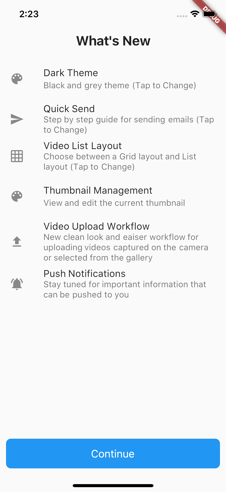

# flutter_whatsnew

[](https://pub.dartlang.org/packages/flutter_whatsnew)

A Flutter Plugin to Show a Whats New page.

## Usage

To use this plugin, add `flutter_whatsnew` as a [dependency in your pubspec.yaml file](https://flutter.io/platform-plugins/).

``` dart
// Import package
import 'package:flutter_whatsnew/flutter_whatsnew.dart';
```


<p align="center"></p>


## Example

``` dart
import 'package:flutter/material.dart';
import 'package:flutter/cupertino.dart';
import 'package:flutter_whatsnew/flutter_whatsnew.dart';

void main() {
  runApp(MaterialApp(home: ShowWhatsNew()));
}

class ShowWhatsNew extends StatelessWidget {
  final double textScaleFactor = 1.0;

  @override
  Widget build(BuildContext context) {
    final _whatsNew = WhatsNewPage(
      title: Text(
        "What's New",
        textScaleFactor: textScaleFactor,
        textAlign: TextAlign.center,
        style: const TextStyle(
          // Text Style Needed to Look like iOS 11
          fontSize: 22.0,
          fontWeight: FontWeight.bold,
        ),
      ),
      buttonText: Text(
        'Continue',
        textScaleFactor: textScaleFactor,
        style: const TextStyle(color: Colors.white),
      ),
      // Create a List of WhatsNewItem for use in the Whats New Page
      // Create as many as you need, it will be scrollable
      items: <ListTile>[
        ListTile(
          leading: const Icon(Icons.color_lens),
          title: Text(
            'Dark Theme',
            textScaleFactor: textScaleFactor,
          ), //Title is the only Required Item
          subtitle: Text(
            'Black and grey theme (Tap to Change)',
            textScaleFactor: textScaleFactor,
          ),
          onTap: () {
            // You Can Navigate to Locations in the App
            Navigator.of(context).pushNamed("/settings");
          },
        ),
        ListTile(
          leading: const Icon(Icons.map),
          title: Text(
            'Google Maps',
            textScaleFactor: textScaleFactor,
          ),
          subtitle: Text(
            'Open Address Links in Google Maps instead of Apple Maps (Tap to Change)',
            textScaleFactor: textScaleFactor,
          ),
          onTap: () {
            // You Can Navigate to Locations in the App
            Navigator.of(context).pushNamed("/settings");
          },
        ),
        ListTile(
          leading: const Icon(Icons.notifications_active),
          title: Text(
            'Push Notifications',
            textScaleFactor: textScaleFactor,
          ),
          subtitle: Text(
            'Stay tuned for important information that can be pushed to you',
            textScaleFactor: textScaleFactor,
          ),
          onTap: () {
            WhatsNewPage.showDetailPopUp(
              context,
              'Info',
              "You can turn off push notifications any time in your application settings.",
            );
          },
        ),
        ListTile(
          leading: const Icon(Icons.arrow_drop_down),
          title: Text(
            'Dropdown Actions',
            textScaleFactor: textScaleFactor,
          ),
          subtitle: Text(
            'New ability to call cell, home and office number from the list dropdown',
            textScaleFactor: textScaleFactor,
          ),
          onTap: () {
            // You Can Navigate to Locations in the App
            WhatsNewPage.showDetailPopUp(
              context,
              'Info',
              "Tap on the down arrow on any list item to display phone numbers and emails.",
            );
          },
        ),
        ListTile(
          leading: const Icon(Icons.info),
          title: Text(
            'Dashboard Alert Icons',
            textScaleFactor: textScaleFactor,
          ),
          subtitle: Text(
            'Depending on the alert type, the icon and color for the list item will change',
            textScaleFactor: textScaleFactor,
          ),
          onTap: () {
            // You Can Navigate to Locations in the App
            Navigator.of(context).pushNamed("/menu");
          },
        ),
        ListTile(
          leading: const Icon(Icons.notifications_none),
          title: Text(
            'Loan Milestone Icons',
            textScaleFactor: textScaleFactor,
          ),
          subtitle: Text(
            'Depending on the Loan Milestone, the icon and color for the list item will change',
            textScaleFactor: textScaleFactor,
          ),
          onTap: () {
            // You Can Navigate to Locations in the App
            Navigator.of(context).pushNamed("/menu");
          },
        ),
        ListTile(
          leading: const Icon(Icons.person_outline),
          title: Text(
            'Loan Contacts Enhancements',
            textScaleFactor: textScaleFactor,
          ),
          subtitle: Text(
            'Updated look for faster navigation',
            textScaleFactor: textScaleFactor,
          ),
          onTap: () {
            WhatsNewPage.showDetailPopUp(
              context,
              'Info',
              "Navigate to any loan then select the bottom right icon to go to the contacts. You can press the dropdown arrow for contact information.",
            );
          },
        ),
      ], //Required
    );
    return new Scaffold(
      body: SafeArea(
        //Whats New Page is Just A Widget, Use in a Scaffold and SafeArea for Best Results
        child: Center(
          child: RaisedButton(
            child: Text("Show Changes"),
            onPressed: () {
              _whatsNew.show(context);
            },
          ),
        ),
      ),
    );
  }
}

```
